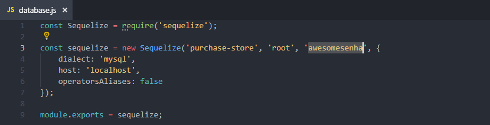

# API Purchase Store

This is an API to manage inventory control and many other features of Purchase Store. Can be cloned and used as reference to similar applications of any other store.

## Running

You'll have to replace the root's password on database.js file in util folder to your current MySQL root's password.



Also you need to create the schema in your MySQL instance, because Sequelize (the ORM) only creates the tables.


Then you can just run the steps bellow to launch the API:

```
npm install
npm start
```

## Environment

* Node.js v8.12.0
* MySQL Community Server 5.7

## Authors

* **Matheus Puppe** - *Project Manager/Developer* - [puppe1990](https://github.com/puppe1990)
* **Matheus Valandro** - *Developer* - [msvalandro](https://github.com/msvalandro)

## License

This project is licensed under the MIT License - see the [LICENSE](LICENSE) file for details
